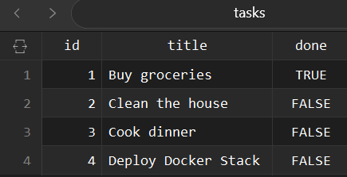
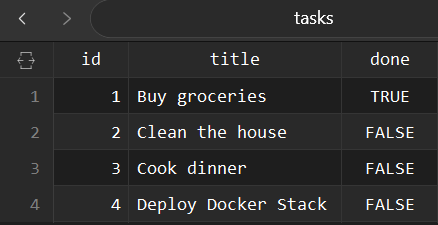

# Task Management CRUD API


A production-ready, containerized backend API for managing tasks, built with **FastAPI**, **PostgreSQL**, and **Docker Compose**.

---

## Overview & Transformations

This project provides a robust task management RESTful API that handles full CRUD (Create, Read, Update, Delete) operations with strict input validation, automatic database initialization, and persistent storage.

### Project Architecture Evolution
This application went through three major architectural transformations:

1.  **Phase 1 (In-Memory Data):** Initial route prototyping using plain Python lists and dictionaries (data was ephemeral and cleared on restart).
2.  **Phase 2 (SQLite File Database):** Introduced file-based SQLite database storage (`tasks.db`) to enable local persistence across server restarts.
3.  **Phase 3 (Containerized PostgreSQL Stack):** Transformed into a full production setup featuring a dedicated **PostgreSQL** container with `SERIAL` auto-incrementing primary keys, volume persistence (`taskdata`), `.env` secrets isolation, and multi-container orchestration via `docker compose`.

---

## Prerequisites

Ensure you have the following installed locally before running the application:

* [Docker Desktop](https://www.docker.com/products/docker-desktop/ ) (includes Docker Engine and `docker compose`)
* [Git](https://git-scm.com/ )
* *(Optional)* A database GUI client such as **TablePlus**, **DBeaver**, or **pgAdmin**

---

## Quick Start (One-Command Setup)

1.  **Clone the repository:**
    ```bash
    git clone https://github.com/shathahsaleem/rest-api-task-management.git
    cd rest-api-task-management
    ```

2.  **Set up Environment Variables:**
    Copy the provided `.env.example` file to create your local `.env` configuration:
    ```bash
    cp .env.example .env
    ```

3.  **Launch the Stack:**
    Run the full application stack (FastAPI app + PostgreSQL database ) with a single command:
    ```bash
    docker compose up
    ```

The API will be live at `http://localhost:3000`.

---

## Environment Variables

All environment configurations are kept out of source control via `.gitignore`. Refer to `.env.example` for local configuration:

| Variable | Description | Default Value |
| :--- | :--- | :--- |
| `DATABASE_URL` | PostgreSQL connection URI for FastAPI | `postgres://postgres:dev@db:5432/tasks` |
| `POSTGRES_USER` | PostgreSQL superuser username | `postgres` |
| `POSTGRES_PASSWORD` | PostgreSQL superuser password | `dev` |
| `POSTGRES_DB` | Target database name | `tasks` |

---

## API Endpoints Matrix

Detailed view of available REST API endpoints:

| Method | Endpoint | Description | Request Body | Success Status | Error Statuses |
| :--- | :--- | :--- | :--- | :---: | :--- |
| **GET** | `/tasks` | Retrieve all tasks | None | 200 OK | N/A |
| **GET** | `/tasks/{task_id}` | Retrieve a single task by ID | None | 200 OK | 404 Not Found |
| **POST** | `/tasks` | Create a new task | `{"title": "Buy milk"}` | 201 Created | 422 Unprocessable |
| **PUT** | `/tasks/{task_id}` | Update task title and/or completed status | `{"title": "Updated", "done": true}` | 200 OK | 404 Not Found |
| **DELETE** | `/tasks/{task_id}` | Delete a task by ID | None | 204 No Content | 404 Not Found |

### Interactive API Documentation
FastAPI automatically generates interactive OpenAPI documentation for your routes accessible directly in the browser while the container is running:
- **Swagger UI:** `http://localhost:3000/docs`: Allows immediate, interactive endpoint execution directly from the browser without needing Postman.
- **ReDoc:** `http://localhost:3000/redoc`: Provides clean, human-readable OpenAPI documentation for backend contracts and request schemas.

---

## Sample `curl -i` Verification Output

Raw HTTP request and response output verifying task retrieval (`GET /tasks` ):

```http
HTTP/1.1 200 OK
date: Wed, 09 Sep 2026 21:00:00 GMT
server: uvicorn
content-length: 184
content-type: application/json

[
  {"id":1,"title":"Buy groceries","done":true}, {"id":2,"title":"Clean the house","done":false}, {"id":3,"title":"Cook dinner","done":false}
]
```

---

## Database Volume Persistence Proof (TablePlus GUI)

PostgreSQL data is mapped to a dedicated Docker named volume (`taskdata`). This guarantees complete data retention across container restarts.

### 1. Start Stack & Create New Task
Run `docker compose up`, then execute the POST /tasks endpoint to insert a new record into PostgreSQL:
```bash
docker compose up

curl -X POST http://localhost:3000/tasks -H "Content-Type: application/json" -d '{"title": "Deploy Docker Stack"}'

```

TablePlus state showing newly created Task #4 in the database:



### 2. Stop Container Stack & Restart
Execute `docker compose down` to destroy the active application and database containers, then spin the stack back up:
```bash
docker compose down
docker compose up -d
```

### 3. Verify Persistent Data After Refresh
After refreshing TablePlus, Task #4 `Deploy Docker Stack` remains intact in the database, confirming the named Docker volume retained all state across container destruction:


